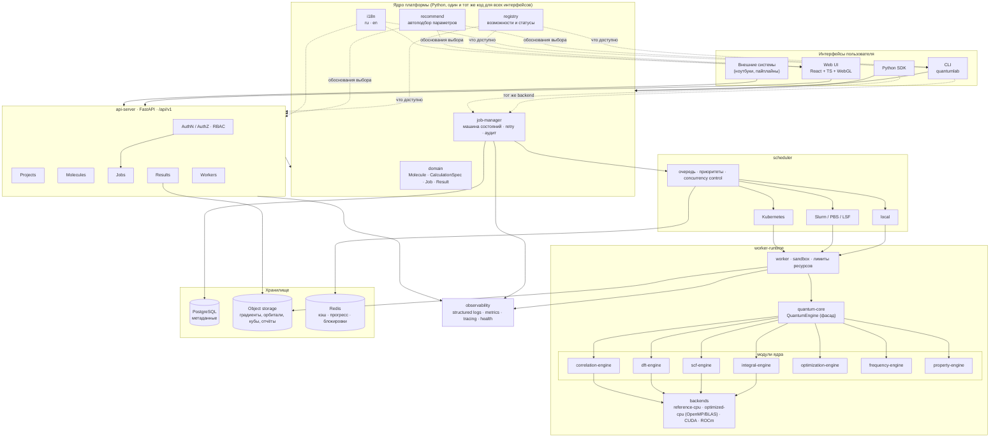

# 01. Архитектура: обзор

## 1. Принципы, из которых выведена архитектура

| № | Принцип | Следствие для архитектуры |
|---|---|---|
| P1 | **Один backend на все интерфейсы** | GUI, CLI, REST и Python SDK — тонкие оболочки над одними и теми же доменными сервисами. Никакой бизнес-логики в контроллерах и компонентах UI. |
| P2 | **Наука отдельно от представления** | Расчётное ядро не знает ни про HTTP, ни про очередь, ни про пользователя. Его вход — `EngineRequest`, выход — `CalculationResult`. |
| P3 | **Всё, что влияет на результат, — данные** | Спецификация расчёта сериализуема, версионируема и хешируется в отпечаток. Нет «скрытых настроек по умолчанию в коде движка». |
| P4 | **Честность вместо имитации** | Реестр возможностей — единственный источник правды о том, что реализовано. Метод без верификации имеет статус `not_implemented` и недоступен для выбора. |
| P5 | **Локализация — часть контракта** | В коде нет UI-строк, только ключи. Русская локализация — язык по умолчанию, английская обязательна; паритет проверяется тестом. |
| P6 | **Отказ — это диагноз, а не строка в логе** | Ошибка несёт код, параметры, список испробованных стратегий и набор исполняемых действий. |
| P7 | **Сначала корректность, потом скорость** | Референсное ядро → верификация → профилирование → оптимизация → бенчмарк. Оптимизированный путь подключается как альтернативный backend, а не заменяет референс. |

## 2. Диаграмма системы



Отдельно сохранена векторная версия: [`../diagrams/architecture-overview.svg`](../diagrams/architecture-overview.svg).

## 3. Поток выполнения расчёта

```text
UI → API → Job Manager → Scheduler → Worker → Quantum Engine → Result Store
```

1. **UI/CLI/SDK** создают `CalculationSpec` (через мастер или явно) и структуру.
2. **recommend** разворачивает профиль точности в полные параметры и возвращает
   список обоснований — их показывает UI.
3. **registry** проверяет, что выбранные метод/базис/функционал действительно
   доступны. Недоступное отклоняется до создания задания, с понятной ошибкой.
4. **Job Manager** создаёт `Job` (UUID, спецификация, отпечаток, владелец,
   проект), сохраняет его в SQL и переводит `DRAFT → QUEUED` атомарно.
5. **Scheduler** выбирает исполнение (local / Slurm / PBS / LSF / K8s) и
   распределяет ресурсы.
6. **Worker** в sandbox'е с лимитами CPU/RAM/GPU вызывает `QuantumEngine.run()`,
   периодически пишет прогресс в Redis и чекпоинты в объектное хранилище.
7. **Quantum Engine** выполняет задачу, возвращает `CalculationResult`:
   скаляры — в SQL, массивы — артефактами в объектное хранилище.
8. **Job Manager** переводит задание в `COMPLETED` или
   `COMPLETED_WITH_WARNINGS`, формирует проверки качества и рекомендации.

## 4. Границы модулей

Каждый модуль из §23 ТЗ существует как отдельный пакет с явным интерфейсом.
Зависимости разрешены только «вниз»:

```text
web-ui / cli / python-sdk ─┐
api-server ────────────────┼──► job-manager ──► scheduler ──► worker-runtime
                           │                                     │
                           └──► domain / i18n / registry ◄───────┤
                                                                 ▼
                                          quantum-core (facade: QuantumEngine)
                                                     │
        ┌────────────┬───────────┬───────────┬───────┴─────┬────────────┐
   integral-engine  scf-engine  dft-engine  correlation  optimization  frequency/property
        └────────────┴───────────┴───────────┴─────────────┴────────────┘
                                     │
                        basis-library · molecule-engine
                                     │
                     backends: cpu (BLAS/LAPACK/OpenMP) · CUDA · ROCm
```

**Правило:** `scf-engine` не импортирует `integral-engine` — он получает его
через параметр типа `IntegralEngine` (structural typing). Поэтому замена
интегрального движка на GPU-реализацию не затрагивает SCF.

## 5. Почему так, а не иначе

| Решение | Альтернатива | Почему выбрано |
|---|---|---|
| Python как язык платформы, C++/CUDA для ядра | всё на C++ или всё на Python | UI/API/очередь на C++ — это месяцы на то, что в Python решается библиотеками; при этом горячий цикл (интегралы, SCF) в Python медленный в 50–200 раз. Граница проходит там, где данные плотные и регулярные. |
| Structural typing (`Protocol`), а не ABC | наследование от абстрактных классов | Внешний движок (PySCF, Psi4, собственный CUDA-код) подключается адаптером без наследования от наших классов и без установки наших зависимостей. |
| Референсное ядро на NumPy первым | сразу писать на C++/CUDA | Без референса нечем верифицировать оптимизированный путь. Референс — это «эталонная правда», с которой сверяются все последующие backend'ы. |
| Реестр возможностей как данные | список методов в коде/GUI | Иначе GUI и ядро неизбежно расходятся; плюс это точка расширения для плагинов. |
| Метаданные в SQL, массивы в объектном хранилище | всё в SQL / всё в файлах | Строка с гессианом на 500 атомов — это мегабайты в таблице: деградация индексов, бекапов и репликации. |

Подробнее — в [`adr/`](adr/).
