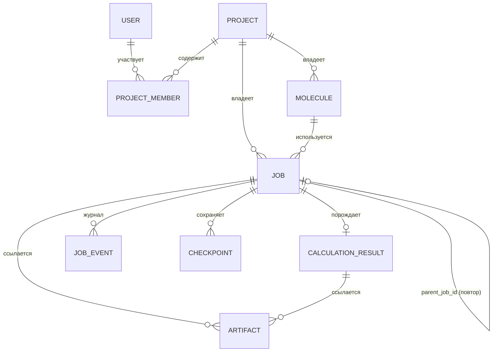
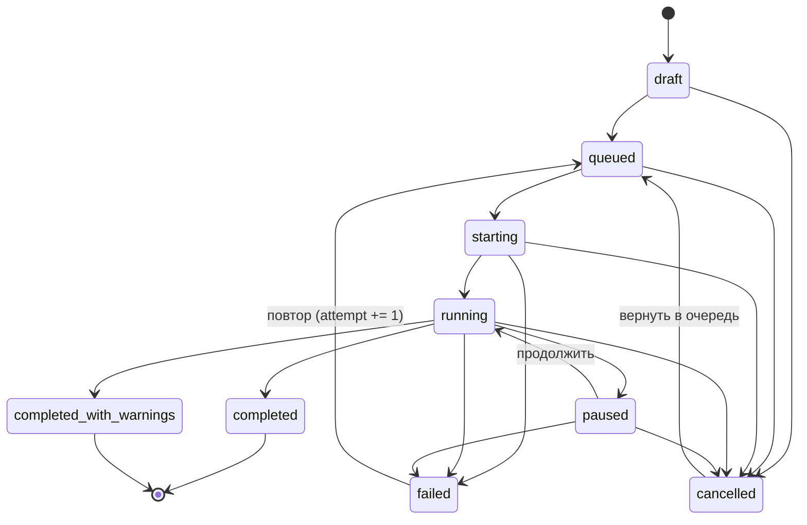

# 04. Доменная модель и схема данных

## 4.1 Сущности



### Molecule

```python
Molecule(name, atoms, bonds, charge, multiplicity)
Atom(symbol, position: tuple[float, float, float], label)   # Å
Bond(i, j, order: single|double|triple|aromatic)
```

**Инварианты, проверяемые при создании:**

- структура не пуста;
- индексы связей в пределах числа атомов, связи не дублируются;
- `n_electrons = Σ Z − charge`;
- мультиплетность совместима с числом электронов:
  `(n_electrons − (m − 1))` чётно и `m − 1 ≤ n_electrons`.

Последний инвариант — не «проверка на всякий случай»: это требование §4 ТЗ
(поиск конфликтов заряд/мультиплетность и предложение корректного значения).
`Molecule.allowed_multiplicities()` возвращает допустимый набор, а ошибка
`molecule.invalid_multiplicity` показывает его пользователю.

Производные свойства: `formula` (нотация Хилла), `n_electrons`,
`structure_hash()` (SHA-256 от состава и геометрии с точностью 1e-8 Å).

### CalculationSpec

Единая спецификация для всех интерфейсов (§23, §40 ТЗ):

```python
CalculationSpec(
    task: single_point | optimization | frequencies | ts_optimization
        | irc | scan_1d | scan_2d | properties,
    profile: screening | standard | high_accuracy | research | None,
    method: MethodSpec(theory, functional, functional_class, basis, dispersion, spin),
    scf: ScfSpec(max_iterations, energy_threshold, density_threshold,
                 diis_start, damping, level_shift, stability_analysis,
                 fractional_occupations, fallback_strategies),
    grid: GridSpec(preset, prune),
    optimization: OptimizationSpec(coordinates, max_steps, max_force, rms_force,
                 max_displacement, rms_displacement, trust_radius,
                 hessian_update, frozen_atoms, constraints),
    scan: ScanSpec | None,
    resources: ResourceSpec(threads, memory_mb, device, nodes,
                            gpus_per_node, scheduler, wall_time_minutes),
    seed: int | None,
    expert_raw_input: str | None,      # экспертный режим (§36 ТЗ)
)
```

Правила валидации:

- для `scan_*` обязательны параметры сканирования;
- нужен хотя бы один из: профиль, явный метод, сырой input;
- DFT требует функционал, HF его запрещает.

`spec.canonical_json()` — детерминированное представление (сортировка ключей),
которое хешируется в отпечаток.

### Job

```python
Job(id: UUID, name, project_id, owner, spec, molecule_uri, molecule_hash,
    status, attempt, priority, parent_job_id,
    created_at, updated_at, started_at, finished_at,
    progress: JobProgress(percent, stage_key, eta_seconds,
                          scf_iteration, optimization_step),
    events: tuple[JobEvent, ...], resources, checkpoint_uri,
    result_uri, log_uri, worker_id, error_code, error_params, tags)
```

Структура и большие данные в задании **не хранятся** — только URI (§24 ТЗ).

### Состояния задания (§13 ТЗ)



Реализовано в `quantumlab/jobs/state_machine.py`; недопустимый переход бросает
`job.invalid_transition` с локализованным сообщением. Терминальные состояния —
`completed` и `completed_with_warnings`: повторный запуск создаёт **новое**
задание со ссылкой `parent_job_id`, что сохраняет историю и делает отчёты
неизменяемыми.

## 4.2 Схема SQL (PostgreSQL)

```sql
CREATE TYPE job_status AS ENUM (
  'draft','queued','starting','running','completed',
  'completed_with_warnings','failed','cancelled','paused'
);

CREATE TABLE users (
  id            UUID PRIMARY KEY,
  email         CITEXT UNIQUE NOT NULL,
  display_name  TEXT NOT NULL,
  role          TEXT NOT NULL DEFAULT 'researcher',   -- RBAC (§25 ТЗ)
  created_at    TIMESTAMPTZ NOT NULL DEFAULT now()
);

CREATE TABLE projects (
  id          UUID PRIMARY KEY,
  name        TEXT NOT NULL,
  owner_id    UUID NOT NULL REFERENCES users(id),
  settings    JSONB NOT NULL DEFAULT '{}'::jsonb,
  created_at  TIMESTAMPTZ NOT NULL DEFAULT now()
);

CREATE TABLE project_members (
  project_id  UUID REFERENCES projects(id) ON DELETE CASCADE,
  user_id     UUID REFERENCES users(id)   ON DELETE CASCADE,
  role        TEXT NOT NULL,             -- owner | editor | viewer
  PRIMARY KEY (project_id, user_id)
);

CREATE TABLE molecules (
  id            UUID PRIMARY KEY,
  project_id    UUID NOT NULL REFERENCES projects(id) ON DELETE CASCADE,
  name          TEXT NOT NULL,
  formula       TEXT NOT NULL,
  charge        INTEGER NOT NULL,
  multiplicity  INTEGER NOT NULL,
  n_atoms       INTEGER NOT NULL,
  structure_uri TEXT NOT NULL,           -- artifact://... (XYZ/SDF в object storage)
  structure_sha TEXT NOT NULL,
  metadata      JSONB NOT NULL DEFAULT '{}'::jsonb,
  created_at    TIMESTAMPTZ NOT NULL DEFAULT now()
);

CREATE TABLE jobs (
  id               UUID PRIMARY KEY,
  project_id       UUID NOT NULL REFERENCES projects(id) ON DELETE CASCADE,
  molecule_id      UUID NOT NULL REFERENCES molecules(id),
  owner_id         UUID NOT NULL REFERENCES users(id),
  parent_job_id    UUID REFERENCES jobs(id),      -- повторный запуск
  name             TEXT NOT NULL,
  status           job_status NOT NULL DEFAULT 'draft',
  attempt          INTEGER NOT NULL DEFAULT 0,
  priority         INTEGER NOT NULL DEFAULT 100,
  spec             JSONB NOT NULL,                -- CalculationSpec
  spec_sha         TEXT NOT NULL,                 -- отпечаток спецификации
  fingerprint_sha  TEXT,                          -- полный отпечаток (§40 ТЗ)
  resources        JSONB NOT NULL,
  progress         JSONB NOT NULL DEFAULT '{}'::jsonb,
  checkpoint_uri   TEXT,
  result_uri       TEXT,
  log_uri          TEXT,
  worker_id        TEXT,
  error_code       TEXT,                          -- код из ErrorCode
  error_params     JSONB NOT NULL DEFAULT '{}'::jsonb,
  tags             TEXT[] NOT NULL DEFAULT '{}',
  created_at       TIMESTAMPTZ NOT NULL DEFAULT now(),
  updated_at       TIMESTAMPTZ NOT NULL DEFAULT now(),
  started_at       TIMESTAMPTZ,
  finished_at      TIMESTAMPTZ,
  CONSTRAINT job_terminal_no_worker CHECK (
    status NOT IN ('completed','completed_with_warnings','failed','cancelled')
    OR worker_id IS NULL OR finished_at IS NOT NULL
  )
);
CREATE INDEX jobs_queue_idx ON jobs (status, priority DESC, created_at)
  WHERE status = 'queued';                       -- выборка очередью
CREATE INDEX jobs_project_idx ON jobs (project_id, created_at DESC);

CREATE TABLE job_events (                         -- аудит (§25 ТЗ)
  id           BIGSERIAL PRIMARY KEY,
  job_id       UUID NOT NULL REFERENCES jobs(id) ON DELETE CASCADE,
  at           TIMESTAMPTZ NOT NULL DEFAULT now(),
  from_status  job_status,
  to_status    job_status NOT NULL,
  actor        TEXT NOT NULL,
  note         TEXT
);

CREATE TABLE checkpoints (
  id          UUID PRIMARY KEY,
  job_id      UUID NOT NULL REFERENCES jobs(id) ON DELETE CASCADE,
  attempt     INTEGER NOT NULL,
  iteration   INTEGER NOT NULL,
  uri         TEXT NOT NULL,
  sha256      TEXT NOT NULL,
  created_at  TIMESTAMPTZ NOT NULL DEFAULT now(),
  UNIQUE (job_id, attempt)                        -- идемпотентность повторов
);

CREATE TABLE calculation_results (
  id                    UUID PRIMARY KEY,
  job_id                UUID UNIQUE NOT NULL REFERENCES jobs(id) ON DELETE CASCADE,
  energy_hartree        DOUBLE PRECISION NOT NULL,
  scf_iterations        INTEGER NOT NULL,
  converged             BOOLEAN NOT NULL,
  homo_hartree          DOUBLE PRECISION,
  lumo_hartree          DOUBLE PRECISION,
  gap_hartree           DOUBLE PRECISION,
  dipole_debye          DOUBLE PRECISION,
  frequencies_cm1       DOUBLE PRECISION[],       -- десятки чисел, не массивы-гиганты
  zpe_hartree           DOUBLE PRECISION,
  quality               JSONB NOT NULL,           -- проверки качества (§28 ТЗ)
  timings               JSONB NOT NULL,           -- wall/cpu по этапам
  environment           JSONB NOT NULL,           -- версия ПО, железо, BLAS, MPI
  fingerprint_sha       TEXT NOT NULL,
  created_at            TIMESTAMPTZ NOT NULL DEFAULT now()
);

CREATE TABLE artifacts (
  id             UUID PRIMARY KEY,
  job_id         UUID REFERENCES jobs(id) ON DELETE CASCADE,
  kind           TEXT NOT NULL,      -- gradient|hessian|orbitals|density|esp|report|...
  uri            TEXT NOT NULL,      -- artifact://bucket/key
  sha256         TEXT NOT NULL,
  size_bytes     BIGINT NOT NULL,
  schema_version TEXT NOT NULL,
  created_at     TIMESTAMPTZ NOT NULL DEFAULT now(),
  UNIQUE (uri)                       -- content-addressed: дедупликация
);

CREATE TABLE audit_log (
  id         BIGSERIAL PRIMARY KEY,
  at         TIMESTAMPTZ NOT NULL DEFAULT now(),
  user_id    UUID REFERENCES users(id),
  action     TEXT NOT NULL,
  subject    TEXT NOT NULL,
  details    JSONB NOT NULL DEFAULT '{}'::jsonb
);
```

**Принцип:** в SQL — скаляры и метаданные. Массивы (градиенты, гессианы,
орбитали, кубические сетки, отчёты) лежат в object storage и подключаются
через `artifacts`. Массив частот оставлен в таблице сознательно: это десятки
чисел, и держать их рядом с результатом удобнее для запросов и экспорта.

## 4.3 Версионирование научных артефактов

Каждый артефакт несёт `schema_version` (сейчас `1.0`). Правила:

1. Изменение формата — новая версия, старые артефакты читаются мигратором;
2. Ключ в object storage включает отпечаток содержимого — повторная запись
   того же массива идемпотентна;
3. `sha256` проверяется при чтении: повреждённый артефакт — это ошибка
   `storage.artifact_missing`/контрольной суммы, а не молча неверные числа.

## 4.4 Отпечаток воспроизводимости (§40 ТЗ)

```text
fingerprint = SHA256({
    software_version, engine_version,
    spec            : SHA256(canonical_json(CalculationSpec)),
    initial_structure, final_structure,
    hardware, environment, seed
})
```

Реализовано в `quantumlab/domain/fingerprint.py`. Инвариант, на котором
держатся регрессионные тесты: **одинаковый отпечаток ⇒ одинаковый результат**
в пределах объявленного порога сходимости.
